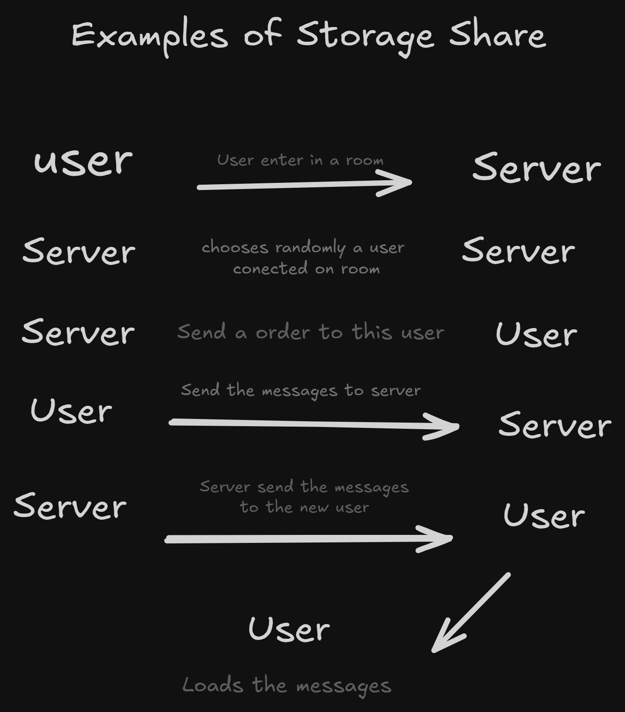

# Nwsc

<div align="center">
    
</div>
<br>

A free, fast messaging app. The focus is simple: create public or private rooms in seconds, exchange messages in real time, and share with whomever you want. All this powered by a backend that can handle the workload and a responsive frontend that can keep up.


## **🎯 Objective**

To deliver a lightweight, scalable chat platform completely oriented towards WebSockets. The user enters, creates rooms, shares the link with friends, and that's it: chatting is happening in no time.

<br>

## **Roadmap**

<div align="center">
    
</div>

# **🏗 Project Architecture**

## **Backend**

The engine of the operation. Where the magic happens.

Stack designed to be lightweight, resilient, and scalable:

* **Database**

* Redis (fast, cacheable)
* **Core**

* Socket.IO

* Local storage + cooperation with the front-end

* Good Database Administration

* Validation with Zod for express routes

* Enhanced security for private rooms

### **Backend Flow for Cooperation with Front-end Storage**

<div align="center">
    
</div>

This way, the server never knows the content of the notes, as it is only the intermediary between a new user and the rest of the room.

### **Private Rooms**

```typescript

/**
* Route to create a private room
*/

router.post("/rooms/create/private", async (_, res) => {
    try {
        const idRoom = v7();

        async function getCode() {
            let code = "";
            let exists = true;
            while (exists) {
                code = Math.floor(Math.random() * 1000000)
                    .toString()
                    .padStart(6, "0");
                exists = Boolean(await db.sIsMember("rooms:private:code", code));
                exists = Boolean(await db.sIsMember("rooms", code));
            }
            return code;
        }

        const code = await getCode();

        // Storage the id of the room
        await db.zAdd("rooms:private:ids", {
            score: Date.now() + 1000 * 60 * 60 * 24 * 3,
            value: idRoom,
        });

        // Storage the code of the private room
        await db.sAdd("rooms:private:code", code);

        // Storage the code of the room, associated to the id
        await db.set(`rooms:private:${idRoom}`, code, { EX: 60 * 60 * 24 * 3 });

        /**
        * Just the id goes to the client, the secret to connect on the room is the code,
        * and its just can find on server with the id.
        * This secret code is stored in a diferent database of the normal rooms,
        * So the client cant connect on the room without the id
        */

        const token = jwt.sign({ id: idRoom }, config.PASSWORD_KEY as string, {
            expiresIn: "1d",
        });

        res.status(200).send({ success: true, token });
        return;
    } catch (error) {
        logger.error(error);
        res.status(500).send({ err: "Error creating room, try again" });
        return;
    }
});

```

### **Route to return code of a private room**

```typescript
/**
 * Route to get the code of a private room
 */

router.get("/rooms/room/private/:token", async (req, res) => {
    try {
        const token = req.params.token;

        try {
            const tokenDecoded = jwt.verify(
                token,
                config.PASSWORD_KEY as string,
            ) as {
                id: string;
            };

            const roomExists = await db.zScore(
                "rooms:private:ids",
                tokenDecoded.id,
            );

            if (!roomExists) {
                return res.status(400).send({ err: "Room not found" });
            }

            const code = await db.get(`rooms:private:${tokenDecoded.id}`);

            if (!code) {
                return res.status(400).send({ err: "Room not found" });
            }

            db.zRemRangeByScore("rooms:private:ids", 0, Date.now());

            res.status(200).send({ success: true, code });
            return;
        } catch (error) {
            logger.error(error);
            res.status(400).send({ err: "Bad request" });
            return;
        }
    } catch (error) {
        logger.error(error);
        res.status(500).send({ err: "Error creating room, try again" });
        return;
    }
});
```

What we can take away from this is that the frontend never, ever, knows the actual room code, except to connect to a new room. Otherwise, the code isn't exposed anywhere, and the only way to get the code is through the server and the JWT, which is encrypted.

---

## **Frontend**

The stage where everything looks good to the end client:

* **Next.js**
* **Tailwind**
* **Socket.io-client**

The choice of Next wasn't accidental; the first version of this chat was made with Vite, but for some reason or lack of Vite's capabilities, the websocket wouldn't connect in the preview version of the project, much less in the build version, but Next.js did.

### **Feature Highlights**

* Real-time typing
* Reply to direct messages
* QR Code to share a room
* Send up to **5 images at a time**
* Image and text compression
* **2 themes** (dark and light, for all tastes)
* Branding (opengraph, logo, specific font, default theme color)
* Currently logged-in users
* Private Rooms
* Chunks data synchronization
* Local and temporary data storage

<br>

# **📦 Monorepo with NPM Workspaces**

Organization of the product's operational units:

```
/
 ├─ front/
 │   └─ package.json
 ├─ back/
 │   └─ package.json
 └─ package.json
```

A repository to govern everything, avoiding a mess of dependencies and enabling good administration. This simple yet effective workspace structure allowed the app to run both separately and together, easily with just a few commands after installing the project.

<br>

# **🧩 Custom Server**

Next sits behind a **custom Express**, which handles handlers, special routes, and all that bespoke governance that ensures strategic flexibility in the pipeline. When a route isn't from Express, it goes to Next.js, enabling a seamless fusion between server and front-end.

Flow:

**Request → Express Handlers → Next (rendering) → Front-end**

Simple, direct, painless.

<br>

# **🐳 Containerization**

Orchestrated Docker environment for isolated operations:

* Backend → own container
* Frontend → own container
* Or both integrated into a third container (Custom Server)

<br>

# **☁ Deployment**

Segmented deployment to beat the best of both worlds:

* **Backend:** Render (easily accepts Docker) + AWS EC2 option
* **Frontend:** Vercel (Best for Next)

<br>

# **✅ Conclusion**

Complete, well-rounded project ready to scale.

People exchange messages, deployment flows smoothly, and the end user has no idea of ​​the chaos we avoided here.

**That's it! Thanks.**


